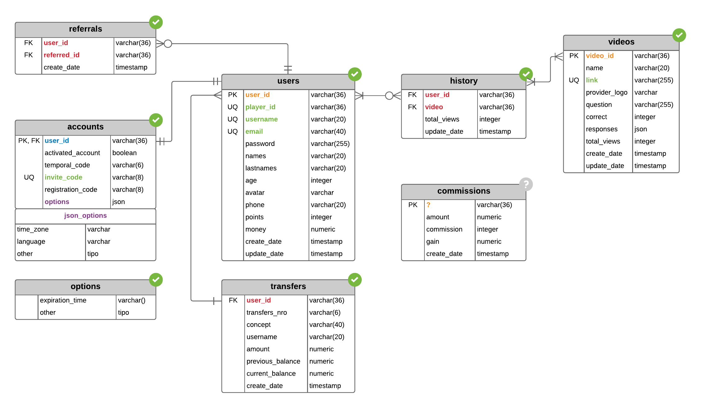

# api-dicabeg

Api RESTful to the application mobile **[Dicabeg](https://instagram.com/dicabeg/)**

### Technologies Used

- Programming language `PHP` **7.3.4**
- Templates engine `Laravel/Blade`.
- Styles language `Stylus` **0.54.5**
- Design pattern **MVC**.
- Sending **email transactional** through `SendGrid`.
- Sending **push notification** through `OneSignal`.
- Administrarion of sessions using `JWT` and `OAuth`.
- Login with **Facebook**.
- Custom query constructor made in flat **PDO**.
- **DataBase** language `PostgreSQL` **10.7**
- **PaaS** to deploy the api `Heroku`.
- Automatic generation of `Email Templates` using `Laravel/Blade`.
- **Minificación** HTML code manual for acceleration of view loading and generation of email templates. Thanks to the bookstore [tiny-html-minifier](https://github.com/jenstornell/tiny-html-minifier.git) realized by [Jens Törnell](mailto:webblayout@gmail.com).

---

## End Points

>USERS

    GET    | api/users/page/{nro}/date-order/{order}
    GET    | api/users
    POST   | api/users
    PACTH  | api/users
    DELETE | api/users
---

>ACCOUNTS

    POST   | api/accounts/login
    POST   | api/accounts/login/refresh
    POST   | api/accounts/login/oauth2   [NO DISPONIBLE]
    POST   | api/accounts/activation
    POST   | api/accounts/recovery
    POST   | api/accounts/resend_email
    PUT    | api/update/email
    PUT    | api/update/password
---

>REFERREDS

    GET    | api/referreds/page/{nro}/date-order/{order}
    GET    | api/referreds/{id}
    DELETE | api/referreds/{id}
---

>TRANSFERS

    GET    | api/transfers/page/{nro}/date-order/{order}
    GET    | api/transfers/{code}
    POST   | api/transfers
    POST   | api/transfers/send_report
---

>HISTORY

    GET    | api/history/page/{nro}/date-order/{order}
    GET    | api/history/{video_id}
    POST   | api/history/{video_id}
    DELETE | api/history/{video_id}
    DELETE | api/history
---

>VIDEOS

    GET    | api/videos/page/{nro}/date-order/{order}
    GET    | api/videos/{id}
---

>ADVERTS

    PUT    | api/adverts/bonus/pay  [NO DISPONIBLE]
    PUT    | api/adverts/enterprise/pay [NO DISPONIBLE]
    GET    | api/adverts/grant/user-id/{userId}/rewards/{rewards}/event-id/{eventId}
---

>APP

    GET    | api/app/roles
    GET    | api/app/ranking
    GET    | api/app/balances
    GET    | api/app/commissions
---

## Entity Relation Diagram

### **[ERD Lucidchart](https://app.lucidchart.com/documents/view/5f826222-d799-4334-8196-18680ddd0ca7) &#x279c;**

---

## Email Templates

To view all the email templates, **[go to this route](./.github/img/email-templates) &#x279c;**