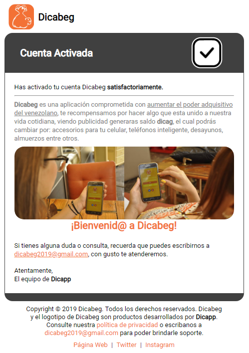

# api-dicabeg

Backend para la aplicación movil **[Dicabeg](https://edixonalberto.github.io/doc-dicabeg/)**

### Tecnologías empleadas

- Lenguaje de programación: `PHP` **7.3.4**
- Motor de plantillas `Laravel/Blade`.
- Lenguaje de estilos `Stylus` **0.54.5**
- Patrón de diseño **MVC**.
- Envío de **email transactional** por medio de `SendGrid`.
- Envío de **push notification** usando `OneSignal`.
- Administración de sesiones utilizando `JWT` y `OAuth`.
- Login con **Facebook**.
- Constructor de consultas personalizado hecho en PHP plano usando **PDO**.
- Lenguaje de **DataBase**: `PostgreSQL` **10.7**
- **PaaS** para el alojamiento del código: `Heroku`.
- Generación automática de `Email Templates` usando Blade.
- **Minificación** de código HTML para la aceleración en la carga de las vistas y la generación de los email templates. Gracias a la librería [tiny-html-minifier](https://github.com/jenstornell/tiny-html-minifier.git) realizada por [Jens Törnell](mailto:webblayout@gmail.com).

---

## Email Template (Cuenta Activada)

---

## Diagrama Entidad Relación

---

## End Points

>USERS

    GET    | api/users/page/{nro}/date-order/{order}
    GET    | api/users
    POST   | api/users
    PACTH  | api/users
    DELETE | api/users
---

>ACCOUNTS

    POST   | api/accounts/login
    POST   | api/accounts/login/refresh
    POST   | api/accounts/login/oauth2   [NO DISPONIBLE]
    POST   | api/accounts/activation
    POST   | api/accounts/recovery
    POST   | api/accounts/resend_email
    PUT    | api/update/email
    PUT    | api/update/password
---

>REFERREDS

    GET    | api/referreds/page/{nro}/date-order/{order}
    GET    | api/referreds/{id}
    DELETE | api/referreds/{id}
---

>TRANSFERS

    GET    | api/transfers/page/{nro}/date-order/{order}
    GET    | api/transfers/{code}
    POST   | api/transfers
    POST   | api/transfers/send_report
---

>HISTORY

    GET    | api/history/page/{nro}/date-order/{order}
    GET    | api/history/{video_id}
    POST   | api/history/{video_id}
    DELETE | api/history/{video_id}
    DELETE | api/history
---

>VIDEOS

    GET    | api/videos/page/{nro}/date-order/{order}
    GET    | api/videos/{id}
---

>ADVERTS

    PUT    | api/adverts/bonus/pay  [NO DISPONIBLE]
    PUT    | api/adverts/enterprise/pay [NO DISPONIBLE]
    GET    | api/adverts/grant/user-id/{userId}/rewards/{rewards}/event-id/{eventId}
---

>APP

    GET    | api/app/roles
    GET    | api/app/ranking
    GET    | api/app/balances
    GET    | api/app/commissions
---
